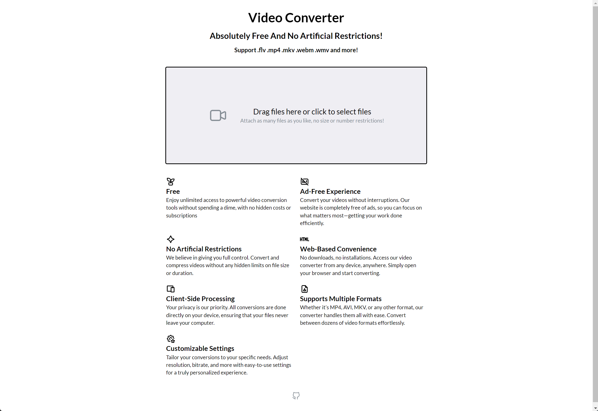
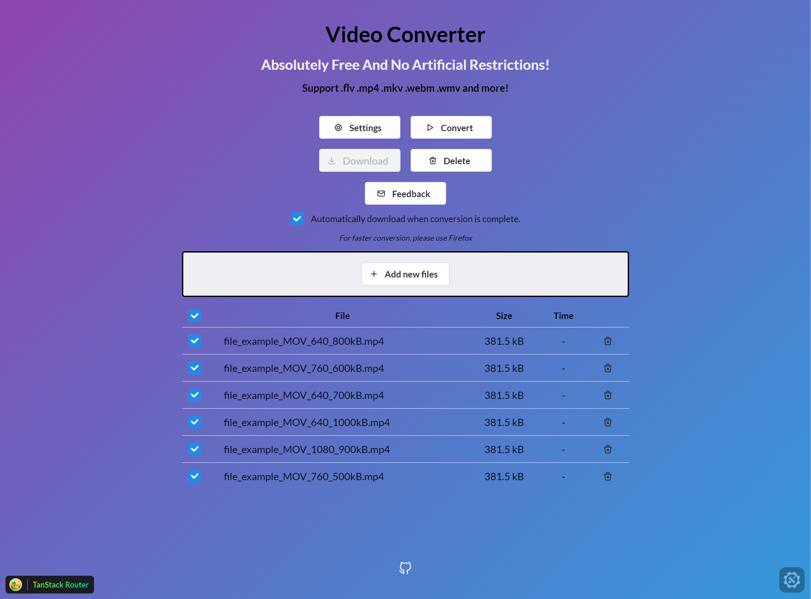

# FileJedi

An absolutely free, client-side-only video converter web app with no artificial restrictions.

setup: `npm run setup`  
dev: `npm run dev`

[Cloudflare Workers Repo](https://github.com/tylim88/File-Jedi-Workers), more is coming!

## Motivation

Traditional converters have several disadvantages:

1. They require payment, or if they are free, they impose artificial restrictions like longer conversion times, limited file sizes, or a cap on the number of files.
2. Privacy concerns: The conversion process occurs on the backend, which may raise issues regarding data security and privacy.
3. Some converters are completely free and client-side only, but they require a download and installation, which can pose security risks.

But what if we could have a client-side-only converter that runs entirely in the browser, with no installation and no artificial restrictions?

JavaScript is a single-threaded programming language, making it impractical for video conversion due to slow processing speeds. However, with WebAssembly, this becomes much more feasible. While the speed is still behind native applications, it is significantly faster than using JavaScript alone.

This project demonstrates how to easily create such an online converter.

Roadmap:

1. video converter (done)
2. audio converter
3. image converter

techs:

1. FFmpeg wasm
2. Typescript
3. Mantine
4. Tan Stack Router
5. Vite
6. Zustand
7. Cloudflare
